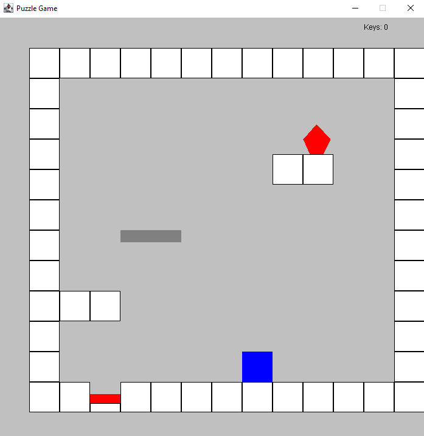
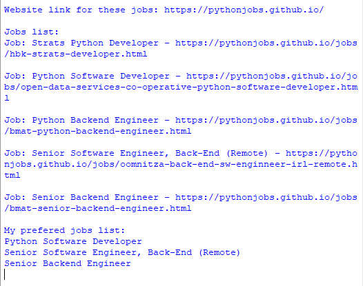

Portfolio
=========

Programming Projects
--------------------

*For access to my private project repositories, please [email me](mailto:kmowens@csustudent.net?subject=GitHub%20Access) with the subject line, GitHub Access.

---
### [Puzzle Game Program | CSCI 325](project1)

---
### [Webscraping Program | CSCI 301](project2)

---
### [Statistics Program | CSCI 409](project3)

---
### [Project 4-In Progress with Permission from Instructor | CSCI 332](project4)

---

Ethics Papers
-------------

### [Ethical Programming](/pdf/Obj-Orient Ethics Paper.pdf)

-   **Class: Object-Oriented Programming (CSCI 325)**  
-   **Grade: 100**

### [Ethical Notification](/pdf/Proc Prog Ethics Paper.pdf)

-   **Class: Procedural Programming (CSCI 235)** 
-   **Grade: 100**

### [Ethical Copyright](/pdf/Scripting Ethics Paper.pdf)

-   **Class: Scripting Languages (CSCI 301)** 
-   **Grade: 100**

---

Presentations
-------------

### [Vehicle and Crime​ Python Analysis Presentation](/pdf/AIProj1Slides.pdf)

- **Class: Fund of Artificial Intelligence (CSCI 409)** 
- **Grade: 100**

### [Presentation 2 Title](/pdf/sample_presentation.pdf)

- **Class:** 
- **Grade:**

---

Page template forked from <a href="https://github.com/csu-cs/csci-portfolio">CSU-CS</a>

<!-- Remove above link if you don't want to attributive -->
