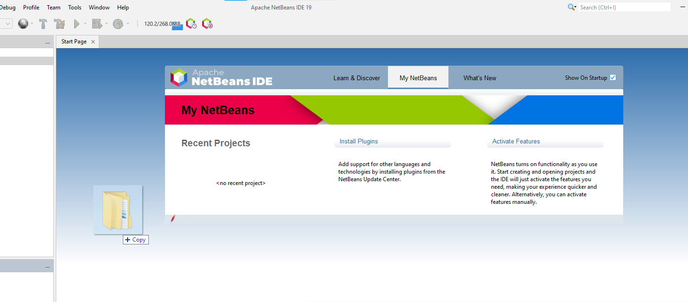
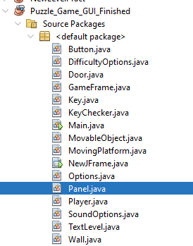
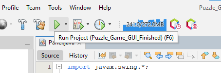

[Back to Portfolio](./)

Puzzle Game
===============

-   **Class: Object-Oriented Programming CSCI 325** 
-   **Grade: 90** 
-   **Language(s): Java** 
-   **Source Code Repository:** [Puzzle Code](https://github.com/KaileyMO/Puzzle-Game/tree/main)  
    (Please [email me](mailto:kmowens@csustudent.net?subject=GitHub%20Access) to request access.)

## Project description

This program is a 2-D puzzle game created in Java code. It contains three levels; each level contains a yellow key that the player must unlock by completing each level's unique puzzle. Once the player collects the level's key, a black door appears and the player goes through the door and to the next level. The player completes these puzzles by moving left, moving right, and jumping.

**Controls:**  
Move left- A  
Move right- D  
Jump- W  
Open menu- Shift

This was a group project, so I did not create the entire game but instead primarily constructed the second level and connected all three levels cohesively.

## How to compile and run the program

To run this program, your device must have Java installed. This program is created on [Netbeans 19](https://netbeans.apache.org/front/main/download/nb19/), so Java JDK 20 should be adequate. Java 20 can be downloaded with [oracle](https://www.oracle.com/java/technologies/javase/jdk20-archive-downloads.html) if necessary.

Assuming Netbeans is the preferred method for compiling and running this program, after its installation, open the application and drag the folder of the unzipped source code for this project into the starter Netbeans space (Fig 1).

  
Fig 1. Drag the code folder into Netbeans.

Access the Puzzle_Game_GUI_Finished -> Source Packages -> <default package> and click on one of the .java files, such as Panel.java. This opens the class's code and will run the project it is connected to (Fig 2).

  
Fig 2. Opens a file from the project.

Click the green arrow at the top of the program to run it (Fig 3).

  
Fig 3. Runs project.

## UI Design

Almost every program requires user interaction, even command-line programs. Include in this section the tasks the user can complete and what the program does. You don't need to include how it works here; that information may go in the project description or in an additional section, depending on its significance.

### Level 1:

The first level requires a button to be pressed for the key to appear. The player will jump up to the lower platform:

  
Fig 1. The launch screen

Another obstacle is the moving platform now located to the player's right. The player must time the jump then jump on to it. Once on this platform, the highest ledge containing a red object is accessible.

  
Fig 2. Example output after input is processed.

  
Fig 3. Feedback when an error occurs.

## 3. Additional Considerations

For the executable .jar file, it is best to run it using a system such as command prompt (cmd). This will allow the program to run the third level since the level requires a screen to print its text. In cmd, open the folder holding the .jar file and run the executable.

```bash
cd ./folder-with-project
java -jar Puzzle_Game_GUI_Finished.jar
```

Additionally, this executable may require Java JDK 20 to be run on. That may be downloaded with [oracle](https://www.oracle.com/java/technologies/javase/jdk20-archive-downloads.html) if necessary.

For more details see [GitHub Flavored Markdown](https://guides.github.com/features/mastering-markdown/).

[Back to Portfolio](./)
