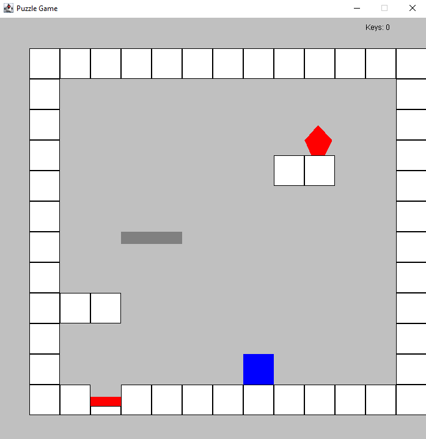

[Back to Portfolio](./)

Puzzle Game
===============

-   **Class: Object-Oriented Programming CSCI 325** 
-   **Grade: 90** 
-   **Language(s): Java** 
-   **Source Code Repository:** [Puzzle Code](https://github.com/KaileyMO/Puzzle-Game/tree/main)  
    (Please [email me](mailto:kmowens@csustudent.net?subject=GitHub%20Access) to request access.)

## Project description

This program is a 2-D puzzle game created in Java code. It contains three levels; each level contains a yellow key that the player must unlock by completing each level's unique puzzle. Once the player collects the level's key, a black door appears and the player goes through the door and to the next level. The player completes these puzzles by moving left, moving right, and jumping.

**Controls:**  
Move left- A  
Move right- D  
Jump- W  
Open menu- Shift

This was a group project, so I did not create the entire game but instead primarily constructed the second level and connected all three levels cohesively.

## How to compile and run the program

To run this program, your device must have Java installed. This program is created on [Netbeans 19](https://netbeans.apache.org/front/main/download/nb19/), so Java JDK 20 should be adequate. Java 20 can be downloaded with [oracle](https://www.oracle.com/java/technologies/javase/jdk20-archive-downloads.html) if necessary.

Assuming Netbeans is the preferred method for compiling and running this program, after its installation, open the application and drag the folder of this project's unzipped source code into the starter Netbeans space (Fig 1).

  
Fig 1. Drag the code folder into Netbeans.

Access the Puzzle_Game_GUI_Finished -> Source Packages -> <default package> and click on one of the .java files, such as Panel.java. This opens the class's code and will run the project it is connected to (Fig 2).

  
Fig 2. Opens a file from the project.

Click the green arrow at the top of the program to run it (Fig 3).

  
Fig 3. Runs project.

## UI Design

There are three levels. The game revolves around this 2-D animated setup (Fig 4), which is the starting position upon loading up the game, where most every object is created from squares. The blue square is the player character and other objects have unique characteristics, like some move on their own and others can be touched by the player.

  
Fig 4. Game starting screen.

### Level 1:

The first level requires a button to be pressed for the key to appear. The player will jump (Fig 5) up to the lower platform (Fig 6):

  
Fig 5. Player jumping to first platform.

  
Fig 6. Player after landing on first platform.

Another obstacle is the moving platform now located to the player's right. The player must time the jump then jump on to it. Once on this platform (Fig 7), the highest ledge containing a red object is accessible (Fig 8).

  
Fig 7. Player after landing on moving platform.

  
Fig 8. Player on the highest platform next to red object.

Now the player must push the red object to the floor (Fig 9) and then into the hole with the button (Fig 10).

  
Fig 9. Player just pushed the red object off the ledge.

  
Fig 10. Player pushing the red object to the hole containing the button.

Successfully pressing this button causes the level's yellow key to appear (Fig 11). The player goes over it to collect it. This opens the black door and adds +1 to the key counter at the top right of the game screen (Fig 12).

  
Fig 11. Yellow key appear after the object clicks the button.

  
Fig 12. Player collects key and a black door appears.

The player has completed the puzzle. Now, the player gets teleported to the next level after running through the door.

## 3. Additional Considerations

For the executable .jar file, it is best to run it using a system such as command prompt (cmd). This will allow the program to run the third level since the level requires a screen to print its text. In cmd, open the folder holding the .jar file and run the executable.

```bash
cd ./folder-with-project
java -jar Puzzle_Game_GUI_Finished.jar
```

Additionally, this executable may require Java JDK 20 to be run on. That may be downloaded with [oracle](https://www.oracle.com/java/technologies/javase/jdk20-archive-downloads.html) if necessary.

[Back to Portfolio](./)
