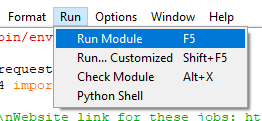

[Back to Portfolio](./)

Webscraping Project
===============

-   **Class: Survey of Scripting Languages (CSCI 301)** 
-   **Grade: 100** 
-   **Language(s): Python** 
-   **Source Code Repository:** [Webscraping Program](https://github.com/KaileyMO/Webscraping-Project)  
    (Please [email me](mailto:kmowens@csustudent.net?subject=GitHub%20Access) to request access.)

## Project description

This program pulls from a website containing a short list of jobs. It displays the job titles and a link to them, and then picks three of the jobs that I consider my favorite options. The program lists jobs from a website and then lists my three preferred options.

## How to compile and run the program

To run this python program, open up an operating system that runs python and go to the folder containing the code file. For an operating system, type something like this to access and then run the program:

```bash
cd ./folder-with-code
python webscraping_program.py
```

If you need software to run python, here is a sufficient system that installs and runs python code, called IDLE: [IDLE download](https://www.python.org/downloads/)  
Once downloaded, go to the source code repository and download the .py file containing this program's code. Right click this downloaded file and select "Edit with IDLE {IDLE version}" (Fig 1).  
  
Fig 1. Run code step 1  

Now, run this code through "Run module", or F5 (Fig 2).  
  
Fig 2. Run code step 2

## UI Design

This project prints information to the screen. It looks through the list of jobs from the website [pythonjobs.github.io](https://pythonjobs.github.io/), and picks out three favored jobs from the list. After running the program, the lists are displayed that the user can analyze (Fig 3).

  
Fig 3. The display screen

## 3. Additional Considerations

Sed ut perspiciatis unde omnis iste natus error sit voluptatem accusantium doloremque laudantium, totam rem aperiam, eaque ipsa quae ab illo inventore veritatis et quasi architecto beatae vitae dicta sunt explicabo. 

For more details see [GitHub Flavored Markdown](https://guides.github.com/features/mastering-markdown/).

[Back to Portfolio](./)
