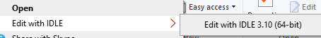
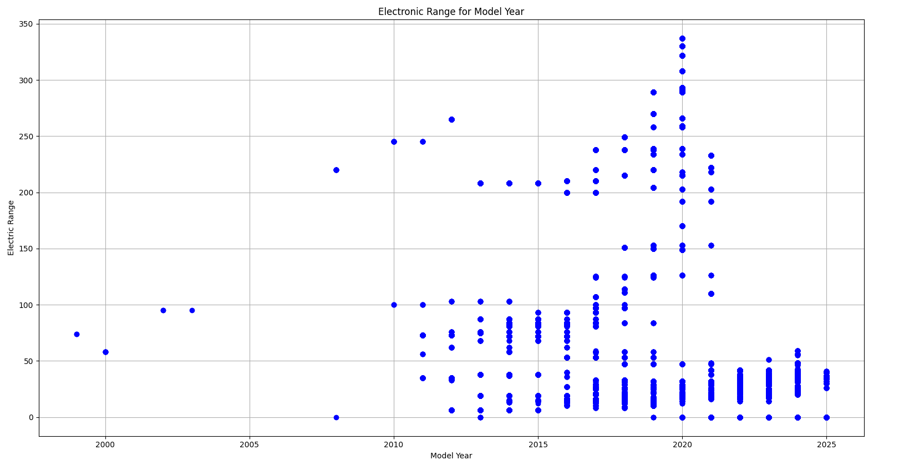
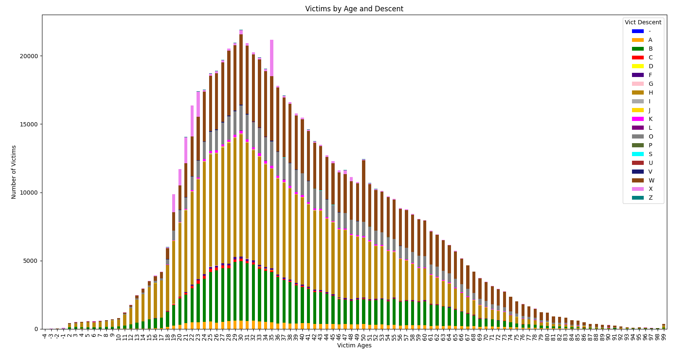

[Back to Portfolio](./)

Data Analysis
===============

-   **Class: Fund of Artificial Intelligence (CSCI 409)** 
-   **Grade: 100** 
-   **Language(s): Python** 
-   **Source Code Repository:** [Analysis Code](https://github.com/KaileyMO/Statistics-Analysis-Project)  
    (Please [email me](mailto:kmowens@csustudent.net?subject=GitHub%20Access) to request access.)

## Project description

This program collects data from a [government website](https://catalog.data.gov/dataset/) and creates analytical graphs from this information. The primary focus is on two different datasets to be analyzed: electronic vehicle statistics and crime rate. The electronic vehicle data is from the State of Washington and the crime rate data is from the City of Los Angelos. Four total graphs are created and the two datasets both get two graphs each. For the electronic vehicles, the first graph analyzes the model year by electronic range and the second graph analyzes the base MSRP by electronic range. The first crime statistics graph analyzes victim amount by sex and the second crime data graph analyzes victim amount by age and race.

## How to compile and run the program

To run this python program, open up an operating system that runs python and go to the folder containing the code file. For an operating system, type something like this to access and then run the program:

```bash
cd ./folder-with-code
python statistics_analysis.py
```

If you need software to run python, here is a sufficient system that installs and runs python code, called IDLE: [IDLE download](https://www.python.org/downloads/)

Once downloaded, go to the source code repository and download the .py file containing this program's code. Right click this downloaded file and select "Edit with IDLE {IDLE version}" (Fig 1).

  
Fig 1. Run code step 1  

Now, run this code through "Run module", or F5 (Fig 2).

  
Fig 2. Run code step 2

### Install

This coding project itself uses libraries such as "requests" and "beautifulsoup", so the system may need to have them installed to run this program. Here are examples of how to install to the system:

```bash
pip install matplotlib
pip install pandas
pip install requests
pip install beautifulsoup4
```

This can work with the IDLE operator as well; input the file explorer's .py file location into Command Prompt, which is found by inputting cmd in the window's search feature, and type the installations there.

```bash
cd ./folder-with-code

pip install matplotlib
pip install pandas
pip install requests
pip install beautifulsoup4
```

## UI Design

This program creates four total graphs. They pop up one at a time so the user will need to exit out of the images as they pop up to get to the next graph.

### Electronic Vehicles

The first graph evaluates electronic vehicles' model year by electronic range. This data is visually observed in figure 3's graph (Fig 3). Once finished analyzing this graph, exit out of it to get to the next one.

  
Fig 3. Output by model year and electronic range.

The second graph evaluates electronic vehicles' base MSRP by electronic range. This data is visually observed in figure 4's graph (Fig 4). Once finished analyzing this graph, exit out of it to get to the next one.

  
Fig 4. Output by MSRP and electronic range.

### Crime Rates

The third graph evaluates crime rates' sex difference by victim count. This data is visually observed in figure 5's graph (Fig 5). Once finished analyzing this graph, exit out of it to get to the next one.

  
Fig 5. Output by sex difference and victim amount.

The third graph evaluates crime rates' victim ages and races by victim count. This data is visually observed in figure 6's graph (Fig 6).  
The races are distributed via color coding, which has a key at the top right of the graph displaying what descent each color represents. Here is further clarification for what the answer key means:

```bash
Descent Code: A - Other Asian B - Black C - Chinese D - Cambodian F - Filipino G - Guamanian H - Hispanic/Latin/Mexican I - American Indian/Alaskan Native J - Japanese K - Korean L - Laotian O - Other P - Pacific Islander S - Samoan U - Hawaiian V - Vietnamese W - White X - Unknown Z - Asian Indian
```

Once finished analyzing this graph, exit out of it to end the program's run.

  
Fig 6. Output by ages and races by victim count.

## 3. Additional Considerations

Sed ut perspiciatis unde omnis iste natus error sit voluptatem accusantium doloremque laudantium, totam rem aperiam, eaque ipsa quae ab illo inventore veritatis et quasi architecto beatae vitae dicta sunt explicabo. 

For more details see [GitHub Flavored Markdown](https://guides.github.com/features/mastering-markdown/).

[Back to Portfolio](./)
