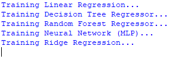
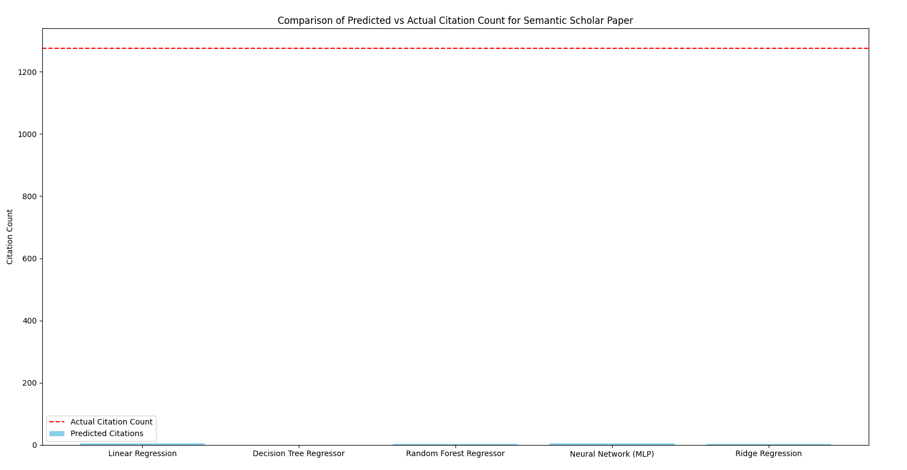
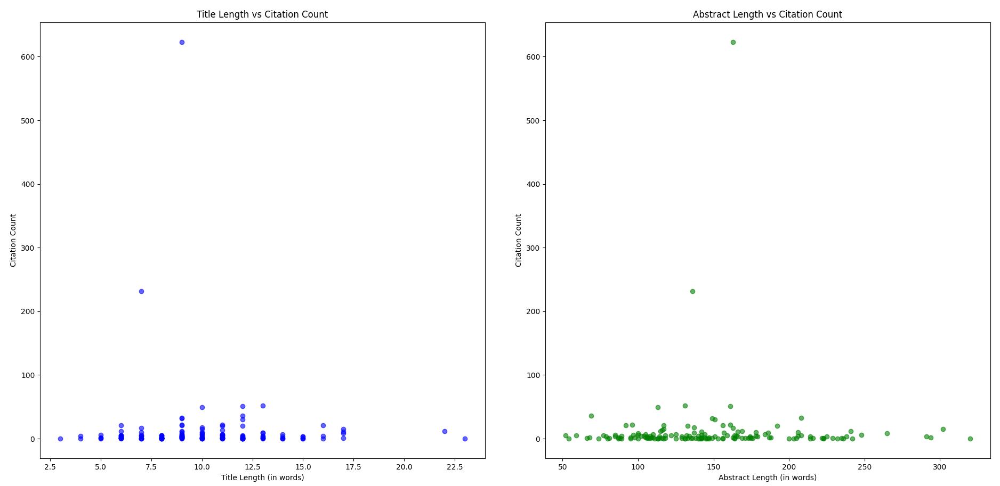
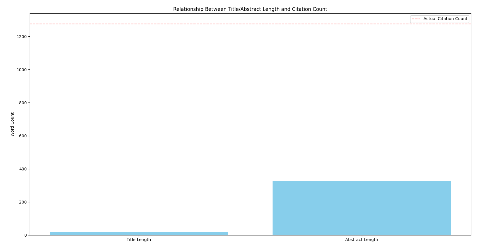
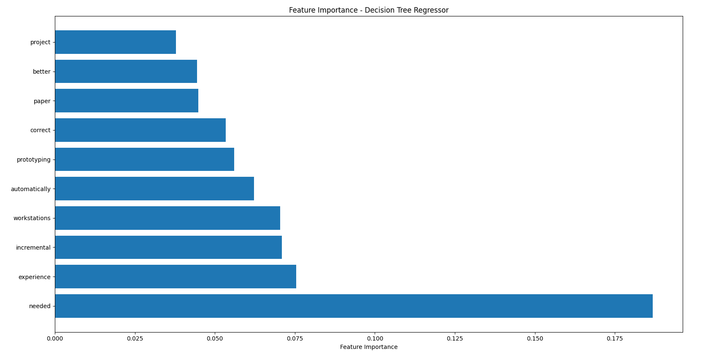
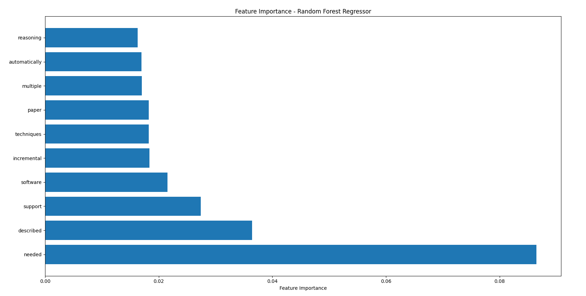
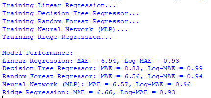

[Back to Portfolio](./)

Machine Learning Project
===============

-   **Class: Fund of Artificial Intelligence (CSCI 409)** 
-   **Grade:** 
-   **Language(s): Python** 
-   **Source Code Repository:** [Machine Learning Code](https://github.com/KaileyMO/ai_machine_learning)  
    (Please [email me](mailto:kmowens@csustudent.net?subject=GitHub%20Access) to request access.)

## Project description

This project collects data from a dataset and then uses this data for machine learning. The program reads in from a dataset and splits it up to test and train multiple models to find the most highly predictable consistencies within the dataset. One of this program's goals is to discover if there is a correlation between an increased abstract count and an increased citation count within the dataset. Around six graphs are created based on these values.

## How to compile and run the program

To run this python program, open up an operating system that runs python and go to the folder containing the code file. For an operating system, type something like this to access and then run the program:

```bash
cd ./folder-with-code
python machine_learning.py
```

If you need software to run python, here is a sufficient system that installs and runs python code, called IDLE: [IDLE download](https://www.python.org/downloads/)

Once downloaded, go to the source code repository and download the .py file containing this program's code. Right click this downloaded file and select "Edit with IDLE {IDLE version}" (Fig 1).

  
Fig 1. Run code step 1  

Now, run this code through "Run module", or F5 (Fig 2).

  
Fig 2. Run code step 2

### Install

This coding project itself uses libraries such as "requests" and "beautifulsoup", so the system may need to have them installed to run this program. Here are examples of how to install to the system:

```bash
pip install pandas numpy scikit-learn matplotlib requests scipy
```

This can work with the IDLE operator as well; input the file explorer's .py file location into Command Prompt, which is found by inputting cmd in the window's search feature, and type the installations there.

```bash
cd ./folder-with-code

pip install pandas numpy scikit-learn matplotlib requests scipy
```

## UI Design

Almost every program requires user interaction, even command-line programs. Include in this section the tasks the user can complete and what the program does. You don't need to include how it works here; that information may go in the project description or in an additional section, depending on its significance.

This program prints out whichever learning module it is working on to the screen (Fig 3). This shows the process and steps that the code is currently on as the models are training.

  
Fig 3. Learning process.

The first graph appears after the training models finish running. This graph compares the citation count of a single fetched paper with the predictions of the models from a separate dataset (Fig 4). Close out of this graph to continue.

  
Fig 4. Prediction vs actual.

Next, a pair of graphs show up analyzing the abstract/title length compared to the citation length (Fig 5). Close out of this graph to continue.

  
Fig 5. Title/abstract vs citation.

Now, this graph compares a single fetched paper's title, abstract, and citation count (Fig 6). Close out of this graph to continue.

  
Fig 6. Title/abstract/citation.

The final two graphs are similar decision trees. They examine what are the most important features from the searched dataset when it comes to the prior training, so it examines which words have the strongest recurrence or impact. The first graph looks through as the decision tree regressor (Fig 7). Close out of this graph to continue.

  
Fig 7. Decision tree regressor.

This second tree analyzes the important features for the machine learning as a Random forest regressor (Fig 8). Close out of this graph to exit out of the graphs.

  
Fig 8. Random forest regressor.

After all the models and visualizations are complete, this program ends on analyzing the model's performance through MAE and Log-MAE (Fig 9).

  
Fig 9. Performances.

Thus concludes this program.

## 3. Additional Considerations

This program requires a csv file titled "papers.csv" to be in the same location as the running code for it to work. Download it in the source code's repository for the program to work as intended.

[Back to Portfolio](./)
